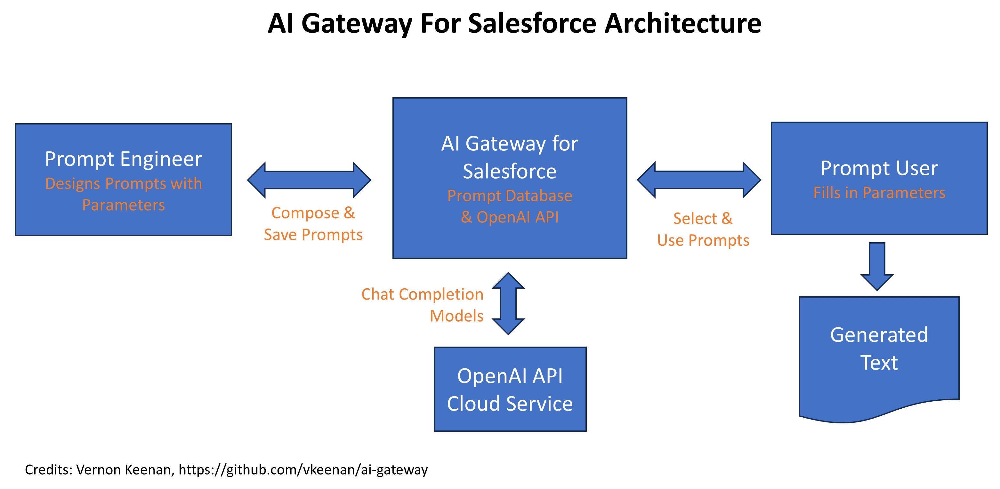

# AI Gateway for Salesforce


Unleash limitless possibilities with our `AI Gateway for Salesforce`, an intuitive Prompt Engineering Platform tailored especially for Salesforce teams. This platform empowers you to create, test, and launch AI prompts within a highly-secured shared repository. The content and responses of these prompts are encapsulated within Salesforce custom objects. With `AI Gateway for Salesforce`, you can leverage parameterized zero-shot prompt engineering to transform your mundane productivity tasks into high-impact efficiencies.

For detailed insight on how `AI Gateway for Salesforce` works, please refer to our blog post: [Introducing AI Gateway for Salesforce: Managed Access for OpenAI API](https://salesforcedevops.net/index.php/2023/06/15/introducing-ai-gateway-for-salesforce/).

To install the project, visit Salesforce AppExchange: <https://login.salesforce.com/packaging/installPackage.apexp?p0=04tHs0000011i4j>. You can also leverage this repository for deploying the project to a Salesforce scratch org for testing and development.

## Project Description

`AI Gateway for Salesforce` is a novel, open-source solution that enables Salesforce users to employ the OpenAI API. This tool has been designed with a custom Salesforce object named `Prompt__c`, thereby allowing developers and users to store prompts that can be sent to OpenAI chat completions API using models like `gpt-4` and `gpt-3.5-turbo`. The responses stored securely in `PromptAnswer__c` object can later be retrieved.

This project presents a minimalist implementation of OpenAI API, serving as a template for organizations to try OpenAI API. The user interface is ingeniously crafted into a simple Flow that administrators and developers can easily modify to ensure customization as per the needs of your organization.


## Table of Contents

- [AI Gateway for Salesforce](#ai-gateway-for-salesforce)
  - [Project Description](#project-description)
  - [Table of Contents](#table-of-contents)
  - [Project Architecture](#project-architecture)
  - [Using OpenAI Services](#using-openai-services)
    - [Cost Controls using OpenAI Services](#cost-controls-using-openai-services)
  - [Privacy Considerations](#privacy-considerations)
    - [Personal Identifiable Information](#personal-identifiable-information)
    - [OpenAI Cloud Service Provider Considerations](#openai-cloud-service-provider-considerations)
  - [Unmanaged Package Post-Installation Notes](#unmanaged-package-post-installation-notes)
    - [Loading JSON Sample File](#loading-json-sample-file)
    - [Loading CSV Sample File](#loading-csv-sample-file)
  - [Local Project Setup](#local-project-setup)
    - [OpenAI Setup](#openai-setup)
      - [Get OpenAI API Key and Organization ID](#get-openai-api-key-and-organization-id)
    - [Salesforce Scratch Org Setup](#salesforce-scratch-org-setup)
      - [Add OpenAI Keys to External Credential](#add-openai-keys-to-external-credential)
      - [Set Up Permissions for External Credential Principal](#set-up-permissions-for-external-credential-principal)
      - [Add Users to Prompt Engineering Permission Set](#add-users-to-prompt-engineering-permission-set)
  - [Using AI Gateway for Salesforce](#using-ai-gateway-for-salesforce)
    - [Using JSON Parameters](#using-json-parameters)
    - [Executing a Prompt](#executing-a-prompt)
  - [License](#license)
  - [Project Contact Information](#project-contact-information)
  - [Project Acknowledgements](#project-acknowledgements)
  - [Project Credits](#project-credits)
  - [Project Sponsors](#project-sponsors)
  - [Project References](#project-references)

## Project Architecture

`AI Gateway for Salesforce` was inspired by the idea "wouldn't it be great if I could share this prompt?" What evolved was a simple solution that allows you to create prompts and share them with other users, but has all the security and safety of Salesforce.

The workflow is envisioned as follows:



Here's a description of that workflow:

1. A Prompt Engineer, someone who is knowledgeable about the subject domain and understands how to craft a prompt, creates a parameterized prompt that will perform a certain function.
2. An end-user then browses a catalog of available prompts. That user selects a prompt and fills out the parameters. The user then executes the prompt.
3. A Flow is executed that sends the prompt to OpenAI and waits for a response and prints it on the screen.

## Using OpenAI Services

There are a few things you should know to set your expectations about using an OpenAI account.

1. OpenAI has many [usage policy restrictions](https://openai.com/policies/usage-policies).
2. OpenAI is domiciled in the United States and subject to [US laws and export restrictions](https://openai.com/policies/terms-of-use).
3. You can use the Free Tier of OpenAI API services, but I don't recommend it. You will be limited to the `gpt-3.5-turbo` model and a limited number of API calls per month.
4. Once you sign up for a paid account, OpenAI will grant you unlimited usage of the `gpt-3.5-turbo` model, but you will need to wait at least 30 days before you can gain access to the `gpt-4` model.

I set all the sample prompts in the repo to use the `gpt-3.5-turbo` model. You can change the model to `gpt-4` if you have access.

### Cost Controls using OpenAI Services

Using the OpenAI API with GPT4 can lead to unexpected charges if you are not aware of your token usage.  OpenAI has billing control features that can put soft and hard stops to your usage once you breach a certain threshold of monthly cost.  Go to the following link to define your hard/soft limits for monthly spend once your API key is created (<https://platform.openai.com/account/billing/limits>)  

GPT consumption is based on the number of tokens used with each request.  A good rule of thumb is that every 4 characters will consume one (1) token. OpenAI has an app that can you use to get an estimate on the number of tokens used (<https://platform.openai.com/tokenizer>)

## Privacy Considerations

The enterprise environment brings along critical privacy concerns while using OpenAI API.

### Personal Identifiable Information

It's pivotal to steer clear of storing any personal identifiable information (PII) in the `Prompt__c` object. The `Prompt__c` object isn't encrypted, leaving any data therein unsecured from everyone having access to the object. Similarly, the `PromptAnswer__c` object also doesn't support encryption and hence can't guarantee the safety of PII.

### OpenAI Cloud Service Provider Considerations

You need to make your own decision whether to used OpenAI API because it requires sending data to the Open AI servers. However, if you believe OpenAI's promises, then it should be safe. Here are some of the promises presented in the latest update to their [API data usage policies](https://openai.com/policies/api-data-usage-policies) from June 14, 2023 and the [OpenAI API data privacy](https://openai.com/api-data-privacy) from July 21, 2023:

1. OpenAI will not use customer data submitted via the API to train or improve their models unless the customer explicitly opts in to share their data for this purpose.
2. Data sent through the API will be retained for a maximum of 30 days for abuse and misuse monitoring purposes, after which it will be deleted (unless required by law).
3. Unlike the consumer ChatGPT-Plus service, where saved conversations are used to improve the model, the API does not save conversations.

Here is some more information from OpenAI: "By default, OpenAI does not use customer data submitted via the API to train their models or improve their services. Data submitted for fine-tuning is only used to fine-tune the customer's model. OpenAI retains API data for 30 days for abuse and misuse monitoring purposes, and a limited number of authorized employees and third-party contractors can access this data solely for investigating and verifying suspected abuse. Data submitted through the Files endpoint, such as for fine-tuning a model, is retained until the user deletes the file."

Bottom line: according to these promises your data will not be saved and used for training. But, I would recommend that you read the OpenAI privacy policy and make your own decision about whether you want to use this project in your own org. As of July 25, 2023 we are still waiting for the OpenAI Business account to be available. I believe OpenAI will be able to provide more assurances about data privacy once the Business account is available.

## Unmanaged Package Post-Installation Notes

Don't forget to assign designated users to the `PromptEngineering` permission set! You also need to upload the sample prompts into the `Prompt__c` custom object. You can do this in one of two ways:

### Loading JSON Sample File

You can also load the sample prompts found in this repository to your org. Copy the `Prompt__c.json` document in the `./data` folder to your local machine. Then use the Salesforce CLI to load the data into your org. Use the following command:

```bash
sfdx data import tree -f Prompt__c.json --target-org <your-org-alias> 
```

### Loading CSV Sample File

If you don't have access to the SDFX or SF commands you can load the sample prompts using a CSV file. I used [dataimporter.io](https://dataimporter.io) to export the sample prompts. To ensure compatibility you should use also use dataimporter.io to load the prompts into your org. You can find the data file in the `./data` folder.

## Local Project Setup

The code provided is designed to work out-of-the-box with Salesforce scratch orgs. You should also be able to adapt it to work with other Salesforce orgs by deploying the metadata elements manually.

### OpenAI Setup

You need to get an OpenAI API key and then configure Salesforce to use it properly. This involves creating a Named Credential and an External Credential. Once we enter the OpenAI keys into Salesforce, they will be safe and cannot be retrieved or copied to your local machine.

#### Get OpenAI API Key and Organization ID

To use `AI Gateway for Salesforce` you will need an OpenAI API key and Organization ID. You can get these by following these steps:

1. Go to <https://platform.openai.com/> and sign up for an API account. You can get a free tier account, but you will be restricted in the number of api calls you can make. And you'll be restricted to the `gpt-3.5-turbo` model.
2. Visit <https://platform.openai.com/account/api-keys> and generate a new key for this project. Keep it in a safe place, and don't put it in any repository.
3. Visit <https://platform.openai.com/account/org-settings> and copy the Organization ID. You'll need this later.

### Salesforce Scratch Org Setup

These scratch org instructions assume you don't already have a `dev-hub` org set up. If you do, you can skip the first two steps.

1. You need to have an Salesforce Developer Edition org or create a new one. This will be your `dev-hub` org. You can create a new one here: <https://developer.salesforce.com/signup>.
1. Enable Dev Hub in your `dev-hub` org. See instructions here: <https://developer.salesforce.com/docs/atlas.en-us.sfdx_setup.meta/sfdx_setup/sfdx_setup_enable_devhub.htm>.
1. Install the Salesforce CLI. See instructions here: <https://developer.salesforce.com/docs/atlas.en-us.sfdx_setup.meta/sfdx_setup/sfdx_setup_install_cli.htm>.
1. Install VS Code and Salesforce CLI Plugin for VS Code. See instructions here: <https://developer.salesforce.com/tools/vscode/en/vscode-desktop/install>.
1. Extract the <https://github.com/vkeenan/ai-gateway> repository to your local machine. See instructions here: <https://help.github.com/en/github/creating-cloning-and-archiving-repositories/cloning-a-repository>.
1. Use VS Code to open the `ai-gateway` folder.
1. Rename the environment file `scripts/.env.example` to `scripts/.env`.
1. Open the file `scripts/.env` with VS Code and enter your dev-hub username. Save the file.
1. Open a terminal window in VS Code (Ctrl+Shift+`).
1. Enter the command `make build` to create the scratch org and load the sample prompts.

#### Add OpenAI Keys to External Credential

1. From the VS Code terminal, enter the command `make open` to go to the scratch org setup page.
2. Enter "named" in the Quick Find box and select Named Credentials.
3. Click on the External Credentials tab.
4. Click on the OpenAI item to edit its details.
5. In the `Principals` section, click on the down arrow in the `Actions` column next to `PromptEngineering` and select Edit.
6. Click Add on Authentication Parameters.
7. Under Parameter 1, enter "apiKey" for the Name.
8. Enter the OpenAI API key you generated in the previous section for the Value.
9. Click Add on Authentication Parameters to add your organization id as the second parameter.
10. Under Parameter 2, enter "Org" for the Name and enter your Organization ID for the Value.
11. Click Save for to update the external credentials Principals settings.

#### Set Up Permissions for External Credential Principal

The External Credential Principal is used to authenticate the external credential. You need to modify the `Prompt Engineering` permission set to gain permission to use it.

1. In the Quick Find box, enter "permission" and select Permission Sets.
2. Click on the `Prompt Engineering` permission set.
3. Click on `External Credential Principal Access` on the right side of the screen.
4. Click Edit.
5. Select the `OpenAI - PromptEngineering` item and click Add.
6. Click Save.

#### Add Users to Prompt Engineering Permission Set

1. Remain in the `Prompt Engineering` Permission Sets screen from the previous section.
2. Click on `Manage Assignments`.
3. Click `Add Assignments`.
4. Click on the users you want to add to the permission set.
5. Click `Next`.

Congratulations! You have completed the setup required to use the OpenAI API from within your Salesforce org, and your API key is safely stored in Salesforce. You are ready to start using the sample prompts.

## Using AI Gateway for Salesforce

Once you have everything set up you can begin sending prompts to OpenAI. Navigate to the Prompt Engineering app from the main application menu. Click the Prompts tab and click New to create a new prompt. Enter a name and title for the prompt and then select the model you want to use.

You can adjust the temperature setting to control the randomness of the response. The higher the temperature, the more random the response. The lower the temperature, the more predictable the response. The default temperature is 0.7, which is a good starting point.

You should then enter a System Messaage and User Message. Here is the difference between the two:

- **System Message**: It should be a message of any length that describes the context of the prompt. You might enter "I am a customer service agent. I am helping a customer with a problem." The system message is automatically sent as the first part of the prompt and generally does not vary between prompts.
- **User Message**: If you have a system message, the user message can be a short message with a request, or it could be a longer message that includes source material. For example, you could enter "Please summarize the sentiment and intent of the customer in this chat session." Then, when you execute this prompt you would paste in the chat session. The system message would be the same, but the user message would change depending on the chat session.

### Using JSON Parameters

Some example prompts use JSON parameters and handlebars notation to insert values into a prompt. For example, the `Market Research` sample prompt uses an extensive System Message to definine how to perform the market research and format the prompt.

But, notice that the Prompt itself is parameterized with the handlebars format:

```text
Create a market analysis for {marketName}.
```

And the Paremters field has the following:

```json
{ "marketName": "Full Market Name" }
```

When you execute this prompt, the system message will be sent to OpenAI with the parameters replaced with the values from the Parameters field. In this case, if you change "Full Market Name" to something like "Salesforce Devops" you will get a market analysis for Salesforce Devops.

You can parameterize your own prompts by using the handlebars notation in the prompt and then defining the parameters in the Parameters field. The parameters must be valid JSON.

The Parameters field is optional. If you don't need to parameterize your prompt, you can leave it blank. It is also not intended to be used to insert very large amounts of text. If you need to insert a large amount of text, you should use paste in the information into the Prompt field instead.

### Executing a Prompt

Once you have created a prompt, you can execute it by clicking the `Execute` button. This will send the prompt to OpenAI and you will have to wait for the response. It can take up to two minutes for a response.

Once the response is received, it is stored in the `PromptAnswer__c` custom object and displayed in the answer screen. Click `Finish` to finish the Flow session.

## License

This project is licensed under the terms of the MIT license. For more details, see the [LICENSE](./LICENSE) file.

## Project Contact Information

For any inquiries about the project, please reach out to `vern@salesforcedevops.net` or <https://linkedin.com/in/vernonkeenan>.

## Project Acknowledgements

We would like to thank the following for their contributions and support:

- Salesforce Community: For their continued support and usage of the project.
- OpenAI: For providing the API used in this project.
- [From Andre Tawalbeh: Tap into the Power of ChatGPT via Flow](https://unofficialsf.com/tap-into-the-power-of-chatgpt-via-flow/)

## Project Credits

- Project Lead: [Vernon Keenan](mailto:vern@salesforcedevops.net)
- Contributors
  - [Chris Pearson](https://www.linkedin.com/in/cpearson31/)

## Project Sponsors

We are currently looking for sponsors. If you are interested in sponsoring this project, please contact us.

## Project References

- [Salesforce Developer Documentation](https://developer.salesforce.com/docs/)
- [OpenAI API Documentation](https://platform.openai.com/docs/)
